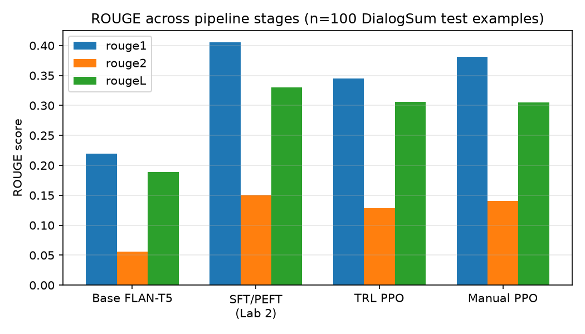

# PPO-RLHF Detoxification — Manual Implementation vs TRL Baseline

Hand-written PPO (advantage estimation + clipped surrogate loss) applied to a
PEFT/LoRA-adapted FLAN-T5 summarizer, benchmarked against HuggingFace `trl`'s
`PPOTrainer` on the same model, data, and hyperparameters.

## Why this exists

`trl.PPOTrainer` hides GAE, the clipped surrogate objective, and the KL
penalty inside `.step()`. This project reimplements those pieces from scratch
in `src/ppo_core.py` and validates correctness by comparing training curves
(reward, KL, clip fraction, ROUGE) against the TRL baseline under identical
conditions.

It extends two labs from a "Generative AI with LLMs" style course: Lab 2
(PEFT/LoRA fine-tunes FLAN-T5 for DialogSum summarization) and Lab 3 (PPO
detoxification via `trl.PPOTrainer`, treating PPO as a black box). This
project's contribution is opening that black box and proving the from-scratch
implementation behaves the same way.

## Status

**Core PPO update logic is validated; two numeric discrepancies remain open.**

A full 200-step run of both pipelines (`configs/config.yaml`, same seed, same
`lab2_peft_adapter` starting checkpoint, same reward model) produced:

- **`clip_fraction` matches almost exactly between the two pipelines**
  (both ~0 throughout, after fixing a dropout/eval-mode bug — see below).
  This is the strongest evidence that the clipped surrogate loss and GAE are
  implemented correctly.
- **ROUGE-L is nearly identical between TRL PPO and manual PPO** (0.306 vs
  0.305 on a 100-example held-out test sample) — see [ROUGE results](#rouge-summarization-quality)
  below. Neither pipeline destroys summarization quality relative to the SFT
  checkpoint (~7-8% relative drop from SFT's 0.330, not catastrophic).
- **Still open:** `reward_mean` is consistently ~0.3-0.4 higher for manual
  PPO than TRL throughout training, and `kl_vs_reference` has the opposite
  sign (TRL: positive, decaying from ~33 to ~8, matching the theoretical
  expectation that KL(π‖π_ref)≥0; manual: negative, flat around -6 to -10).
  The `compute_kl` sign convention was checked against TRL's `_kl_penalty`
  and matches exactly, so this isn't a simple sign-flip bug — root cause
  investigation is paused for now. See `outputs/logs/comparison.png`.

**Bugs found and fixed along the way** (the actual point of this project —
these are exactly the details `trl.PPOTrainer` hides):
1. `per_token_logprobs` crashed on padding tokens (`torch.gather` with a
   negative index) instead of masking them out.
2. The manual pipeline logged the wrong "KL" — a trust-region diagnostic
   (old-vs-new policy drift within one update), not the policy-vs-reference
   divergence TRL's `objective/kl` actually measures.
3. Even after logging the right quantity, the aggregation convention didn't
   match TRL's (`sum per sequence, then mean over batch` vs. a flat
   per-token mean) — off by roughly the average response length.
4. The policy model was never put in `.eval()` mode, so FLAN-T5's dropout
   (compounding across 24 transformer blocks) injected ~1 nat/token of noise
   into the PPO ratio — enough to make ~90% of tokens look "clipped" from
   step 0, before any real weight update. Fix: keep the policy in `.eval()`
   for both old and new logprob computation (this doesn't block gradient
   flow, it only disables dropout).
5. `train_trl_baseline.py` hardcoded `min_length=5` instead of reading
   `output_min_length` from config, and TRL's per-example generation-length
   sampling wasn't mirrored in the manual pipeline's batched generation.

## Project layout

```
ppo-rlhf-detox/
├── configs/
│   └── config.yaml          # all hyperparameters in one place
├── src/
│   ├── utils.py              # seeding, logging, metric tracking
│   ├── data.py                # DialogSum loading + prompt/response tokenization
│   ├── models.py              # ValueHead + PolicyWithValueHead, ref model setup
│   ├── reward.py              # reward model wrapper (toxicity classifier scoring)
│   ├── ppo_core.py            # reward shaping, GAE, clipped surrogate loss <- the hand-written math
│   ├── rollout.py             # generation + logprob computation
│   ├── train_peft_sft.py      # Lab 2 PEFT/LoRA summarization fine-tune (real training, not the 1-step demo)
│   ├── train_manual_ppo.py    # main training script (your implementation)
│   ├── train_trl_baseline.py  # same setup, using trl.PPOTrainer
│   ├── compare_runs.py        # loads both run logs, plots reward/KL/clip-fraction side-by-side
│   └── eval_rouge.py          # ROUGE across base / SFT / TRL-PPO / manual-PPO checkpoints
├── scripts/
│   ├── run_peft_sft.sh
│   ├── run_manual.sh
│   └── run_baseline.sh
├── tests/
│   └── test_ppo_core.py       # unit tests: hand-computed toy values for GAE/loss
└── outputs/
    ├── checkpoints/           # lab2_peft_adapter, trl_baseline, manual_ppo (LoRA adapters, small enough to commit)
    └── logs/                  # per-step metrics (jsonl), comparison.png, rouge_results.json
```

## Setup

```bash
python3 -m venv .venv
source .venv/bin/activate
pip install -r requirements.txt
```

`requirements.txt` pins exact versions (`trl==0.7.11`, `transformers==4.38.0`,
`peft==0.9.0`, `accelerate==0.27.2`) — `trl` rewrote its `PPOTrainer` API after
0.7.x, so open-ended `>=` bounds resolve to an incompatible combination. Don't
loosen these without re-verifying `from trl import
AutoModelForSeq2SeqLMWithValueHead, PPOConfig, PPOTrainer,
create_reference_model` still imports cleanly.

## Running

```bash
# 0. (First time only) Train the Lab 2 PEFT/LoRA summarization adapter for real
python3 src/train_peft_sft.py --max-steps 500

# 1. Baseline (TRL PPOTrainer) — establishes ground truth curves
bash scripts/run_baseline.sh

# 2. Your hand-written PPO — same config, same seed
bash scripts/run_manual.sh

# 3. Compare the two runs (reward / KL / clip fraction)
python3 src/compare_runs.py --baseline outputs/logs/trl_baseline.jsonl --manual outputs/logs/manual_ppo.jsonl

# 4. Compare summarization quality (ROUGE) across all four stages
python3 src/eval_rouge.py --n-samples 100
```

## Unit tests first

Before running full training, verify the math in isolation:

```bash
pytest tests/ -v
```

`test_ppo_core.py` checks GAE and the clipped loss against small
hand-computed cases — do this before touching the LLM, it's much faster to
debug a bug in a 3-step toy example than inside a training loop.

## ROUGE (summarization quality)

100-example held-out sample from the DialogSum test split, greedy decoding:

| stage | rouge1 | rouge2 | rougeL | rougeLsum |
|---|---|---|---|---|
| base (no adapter) | 0.219 | 0.056 | 0.189 | 0.188 |
| sft_peft (Lab 2) | 0.405 | 0.151 | 0.330 | 0.330 |
| trl_baseline | 0.345 | 0.128 | 0.306 | 0.307 |
| manual_ppo | 0.381 | 0.141 | 0.305 | 0.304 |



## Ablations (see configs/config.yaml)

Sweep `kl_coef`, `clip_eps`, `gae_lambda`, `ppo_epochs` — each run writes to
its own log file under `outputs/logs/ablation_<name>.jsonl` for later
comparison plots. **Not run yet** — planned follow-up.

## Data

- Prompts: `knkarthick/dialogsum` (HuggingFace) — same as the original lab
- Reward model: `facebook/roberta-hate-speech-dynabench-r4-target`
- Planned extension: train a real reward model on
  `openai/summarize_from_feedback` (summarization preference pairs) instead
  of reusing a borrowed toxicity classifier — completes the SFT → reward
  model → RLHF three-stage pipeline. Not started; deferred until the
  remaining reward/KL discrepancy above is resolved or explicitly accepted.
